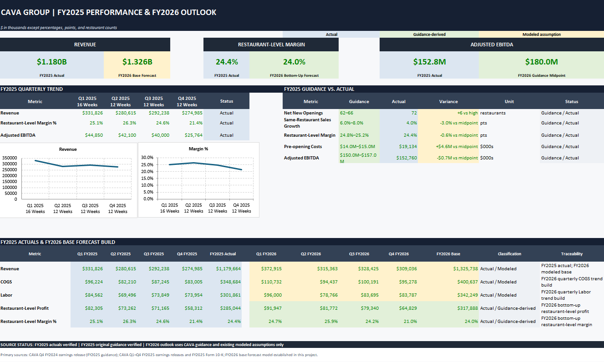

# CAVA Group — FY2026 Restaurant-Level FP&A Model & Forecast Reconciliation

*Modeling CAVA's Unit Economics: An FP&A Deep Dive*



📹 **[Watch the video walkthrough](media/cava_walkthrough_compressed.mp4)** of the model (opens GitHub's built-in video player; click "View raw" if it doesn't preview inline).

## Executive Summary

I rebuilt CAVA Group's FY2025 restaurant-level P&L from its public SEC filings, reconciled it against the company's own original guidance, and built the FY2026 outlook two independent ways. Same-restaurant sales growth missed guidance by up to 4 points (4.0% actual vs. 6.0%–8.0% guided), but unit growth beat it (72 openings vs. 62–66 guided) — enough to land Adjusted EBITDA within the original guided range ($152.8M vs. $150.0M–$157.0M) despite the comp-sales shortfall. An early reconciliation break led to a rebuild of the entire FY2025 actuals on segment basis rather than consolidated basis — a distinction CAVA's own MD&A flags as material. The resulting FY2026 forecast, built bottom-up and top-down independently, agrees to within **0.03 margin points**.

## Business Questions

- How did CAVA's FY2025 actual results compare to its own originally issued guidance, line by line?
- Which drivers offset which — did unit growth actually cover the same-restaurant sales shortfall, or just mask it?
- Do two independently built FY2026 forecasting methods, bottom-up and top-down, converge on the same answer?
- Where does segment-basis vs. consolidated-basis financial reporting create reconciliation risk in a restaurant-level model?
- Which FY2026 assumptions are directly guidance-derived, which are modeled, and which are still genuinely open questions?

## Tools & Skills

- **Excel financial modeling:** restaurant-level P&L build, scenario forecasting (Low/Base/High), and cross-method reconciliation using auditable formulas — SUM, IF, and SUMPRODUCT rather than complex lookups, so the model stays maintainable by someone other than its author.
- **Guidance-vs-actual / variance analysis:** line-by-line comparison of FY2025 actuals to original management guidance, with sourced variance narratives.
- **Financial statement analysis:** distinguishing segment-basis from consolidated-basis disclosures and rebuilding a dataset when the two were mixed.
- **Primary-source research:** every modeled figure traced back to a specific 10-Q or 8-K exhibit before being used.
- **Verification discipline:** treating reconciliation as a required build step — see "Building verification into the process" below.

## Data Sources

| Source | Use |
|---|---|
| CAVA Q1–Q3 FY2025 Form 10-Q filings | Quarterly segment-basis revenue, COGS, labor, and restaurant-level detail |
| CAVA Q4/FY2025 Form 8-K, Exhibit 99.1 | Full-year actuals and FY2026 guidance figures |
| CAVA Q4/FY2024 earnings release | Original FY2025 guidance (the budget baseline for guidance-vs-actual) |

Full source list with URLs is in the workbook's Source Register tab.

## What's in the model

The workbook is eleven tabs, moving from raw inputs to finished analysis:

- **FY25 Actuals** — quarterly restaurant-level P&L, rebuilt entirely on a consistent (segment) basis
- **FY26 RL Assumptions** — the drivers behind the forecast: same-restaurant sales growth, new unit openings, ramp timing
- **FY26 RL Forecast** — a bottom-up build, quarter by quarter
- **Scenario Summary** — a top-down build, working backward from management's own guidance
- **Margin Reconciliation** — where the two approaches get checked against each other
- **KPI Dashboard, Quarterly Trend, Guidance vs. Actual, Model Guide, Data Gaps, Source Register** — supporting structure and documentation

## Key Findings

**Same-restaurant sales miss, offset by unit growth.** CAVA guided 6.0%–8.0% same-restaurant sales growth for FY2025; actual came in at 4.0%. On its own that reads as a slowdown. But net new openings beat guidance (72 vs. 62–66 guided), and the added volume was enough to land Adjusted EBITDA within the original guided range — a substitution of unit growth for comp growth, not a clean beat or a clean miss.

**Segment-basis vs. consolidated-basis reconciliation risk.** An early version of the restaurant-level profit reconciliation didn't tie out. The cause: Restaurant-Level Profit was pulled from CAVA's segment-basis disclosure while COGS came from a consolidated-basis statement in a different filing — both individually correct, but not measuring the same thing. Rebuilding FY2025 actuals entirely on segment basis (which CAVA's own MD&A identifies as the correct lens for restaurant-level performance) made the reconciliation hold exactly.

**Two independent FY2026 forecasts agree within 0.03 points.** A bottom-up build (each quarter's COGS/Labor/Occupancy percentages derived from FY2025 actuals, with a +0.4pt COGS overlay reflecting the upward trend through the year) produced a 23.98% full-year Restaurant-Level Margin. A top-down build (CAVA's guided margin range applied directly to modeled revenue, solved backward for implied costs) produced a 23.95% midpoint. Neither number is "more correct" — having two independent methods converge is the actual point.

## The story behind the model

**Why I built this.** I wanted to go beyond a resume line and actually do the work of a Financial Analyst at a public, multi-unit restaurant company — not summarize CAVA's numbers, but build the model an analyst on their team would actually maintain: a full restaurant-level P&L, a FY2026 forecast built two independent ways, and a reconciliation between them. Everything in this project is sourced directly from CAVA's public SEC filings. No modeled figure went into the workbook without being traced back to a primary source first.

**The mistake that shaped the whole project.** Early on, my restaurant-level profit reconciliation wasn't tying out — the numbers were close, but not exact. I traced it back line by line and found the actual problem: I'd pulled Restaurant-Level Profit from CAVA's segment-basis disclosures, and COGS from a consolidated-basis statement in a different filing. Both figures were individually correct. They just weren't measuring the same thing. That distinction turned out to matter more than I expected — CAVA's own MD&A states that segment-basis results are what's most useful for assessing restaurant performance, since consolidated figures blend in G&A and pre-opening costs that have nothing to do with whether an individual restaurant's unit economics actually work. It's a small thing on the surface, but it's the kind of error that's invisible until you build a check that forces it to surface — which became the design principle for the rest of the project.

**Building verification into the process, not around it.** On a model with this many moving pieces — quarterly actuals, two independent forecast methods, a margin reconciliation between them — I treated verification as a required build step, not an optional check at the end. A reconciliation structure that forces figures to tie out will surface the ordinary errors that creep into any complex model: numbers pulled from inconsistent bases, hardcoded totals that look right but won't update if an input changes, a step that silently recalculates something instead of pulling from the verified dataset. The segment-vs-consolidated basis conflict described above is the clearest example — an error that was invisible until a check forced it to surface. That's the design principle behind the rest of the workbook: build the check in from the start, don't bolt it on afterward.

**What I'd do differently.** The model is intentionally built on simple, auditable formulas because a model other people have to trust and maintain is worth more than one that's needlessly clever. If I extended this project, the next step would be integrating a proper data model (Power Query/Power Pivot/DAX) the way I've done in other practice projects, to make the structure scale past a single company's filings.

**The takeaway.** Building this wasn't really about proving I could model CAVA's numbers. It was about proving I default to checking my own work — tracing figures to source, reconciling independent methods against each other, and treating a clean-looking output as a hypothesis to test rather than a fact to trust. That's the habit I think matters most in FP&A, and it's the one this project was actually designed to demonstrate.

## Project Structure

```
cava-fy2026-fpa-portfolio/
├── CAVA_FY2026_FPA_Portfolio_Package_v2.0.xlsx   # 11-tab workbook (see "What's in the model")
├── images/
│   └── kpi_dashboard.png
├── media/
│   └── cava_walkthrough_compressed.mp4           # video walkthrough
└── README.md
```

## Modeling conventions

- Units: $ in thousands, except percentages, weeks, and restaurant counts.
- **Blue font** — hardcoded historical inputs and editable assumptions.
- **Green font** — formulas linked from another worksheet.
- **Black font** — formulas calculated within the same worksheet.
- **Yellow fill** — open assumption requiring human input or approval.
- Status labels: Actual / Guidance-derived / Modeled assumption / Open assumption.

---

*All figures sourced from CAVA Group, Inc. public SEC filings (10-Q, 8-K). This project was built independently as a demonstration of financial modeling and analysis methodology, and is not affiliated with or endorsed by CAVA Group, Inc.*
